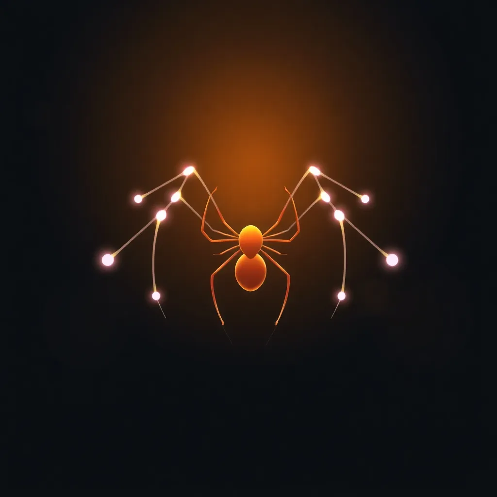

# SpiderBanner React Package



**SpiderBanner** is a lightweight and customizable React component that adds interactive, mouse-responsive animations to your web applications. Perfect for creating modern and engaging banners with animated dots and dynamic connecting lines.

## 🎉 Features
- **Customizable Design**: Adjust the number, size, and colors of dots to match your theme.
- **Interactive Animations**: Dots connect with dynamic lines based on mouse movement.
- **Responsive**: Adapts seamlessly to different screen sizes.
- **Lightweight and Fast**: Minimal performance impact.
- **Easy Integration**: Works with any React project out of the box.

---

## 🔗 Links
- [**Package**](https://www.npmjs.com/package/spider-banner)
- [**Post**](https://www.linkedin.com/pulse/spiderbanner-fun-engaging-react-component-interactive-satyam-anand-zux4c/?trackingId=1b7c%2FLpGST2i48p%2FYjPZkw%3D%3D)
- [**Demo**](https://youtu.be/cnMWZQA_lVE)
- [**Product Hunt**](https://www.producthunt.com/products/spider-banner)

---

## 📦 Installation

Install the package via npm or yarn:

```bash
npm install spider-banner-react
# OR
yarn add spider-banner-react
```

## 💡 Usage
Here’s an example of how to use the SpiderBanner component in your React project:

```jsx
import React from 'react';
import SpiderBanner from 'spider-banner-react';

const App = () => {
  return (
    <SpiderBanner noOfDots={50} colors={['#FF5733', '#33CFFF']} lineLenght={80}>
      <h1>Welcome to My Website!</h1>
    </SpiderBanner>
  );
};

export default App;
```
## Props
| Prop         | Type            | Default           | Description                                  |
|--------------|-----------------|-------------------|----------------------------------------------|
| `noOfDots`   | `number`        | `50`              | The total number of animated dots.          |
| `colors`     | `Array<string>` | `['white', 'black']` | An array of colors for the dots.            |
| `lineLenght` | `number`        | `10`              | The maximum length of the lines.            |
| `children`   | `ReactNode`     | `null`            | Content to display inside the banner.       |


## 📐 Customization
#### Example with Custom Dots and Colors:
```jsx
<SpiderBanner 
  noOfDots={100} 
  colors={['#FF0000', '#00FF00', '#0000FF']} 
  lineLenght={100}>
  <div>
    <h2>Custom Banner</h2>
    <p>With colorful, interactive effects!</p>
  </div>
</SpiderBanner>
```

## 🛠 Development
### Run and Test Locally
1. Fork the repository.

2. Clone the repository:
```bash
git clone https://github.com/{your_username}/spider-banner.git
```
3. Change directory and Install dependencies:
```bash
cd spider-banner
npm install
```
4. Build the package:
```bash
npm run build
```
5. Link the package Locally
```bash
npm link
```
6. Check the linked package locally

```bash
npm link spider-banner
```
7. Genrate a pull request

## 📄 License
This package is licensed under the MIT License. Feel free to use it in personal or commercial projects.

## 🤝 Contributing
We welcome contributions! If you have ideas or find bugs, feel free to submit issues or pull requests.

## 🌟 Support
If you find this package helpful, consider giving it a ⭐ on GitHub. Your support means a lot!